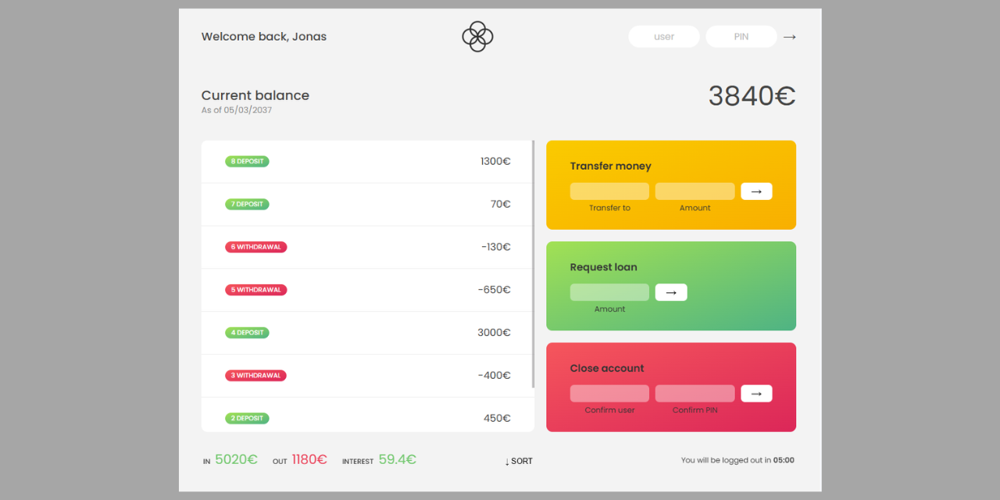

### javascript-course-bankist1

# 🤑 "Bankist 1" - an online bank interface

## Table of contents

- [Project Title](#"bankist1"-an-online-bank-interface)
- [Overview](#overview)
- [The Project](#the-project)
- [App Instructions](#instructions)
- [Technology stack](#technology-stack)
- [Links](#links)
- [Visuals](#visuals)
- [Project Status](#project-status)
- [Author](#author)

## Overview

### The Project

„Bankist 1” stands for minimalist banking and presents an online bank interface consisting of a welcome message, an overall balance of the account, some summary data, and a history of deposits and withdrawals. The user has three options to perform: transferring money, requesting money, and closing the account. The app requires the user to log in (Read the 'Instructions' below.).

### Instructions:

The app requires the user to log in. 
After filling in the log-in inputs 'user' and 'PIN' with data 'js' and '1111',  the page layout is displayed.

### Technology stack

- HTML
- CSS
- JavaScript

### Links

- Source code repository URL: [Github]https://github.com/basiacarvalho/javascript-course-bankist1)
- Live Site URL: [Live demo](https://basiacarvalho.github.io/javascript-course-bankist1/)

### Visuals

#### Tablet and Desktop view :

### Project Status

- Completed (with the possiblity for future adaption)\
  The basic concepts of the project have been met, however further ideas may be implemented and added in the future.

### Author

👩‍💻 The "Bankist 1" is the result of taking part in a course on Udemy: 'The Complete JavaScript Course 2025: From Zero to Expert!' by Jonas Schmedtmann. The code comes from the course content (The "README.md" file was created by me).

